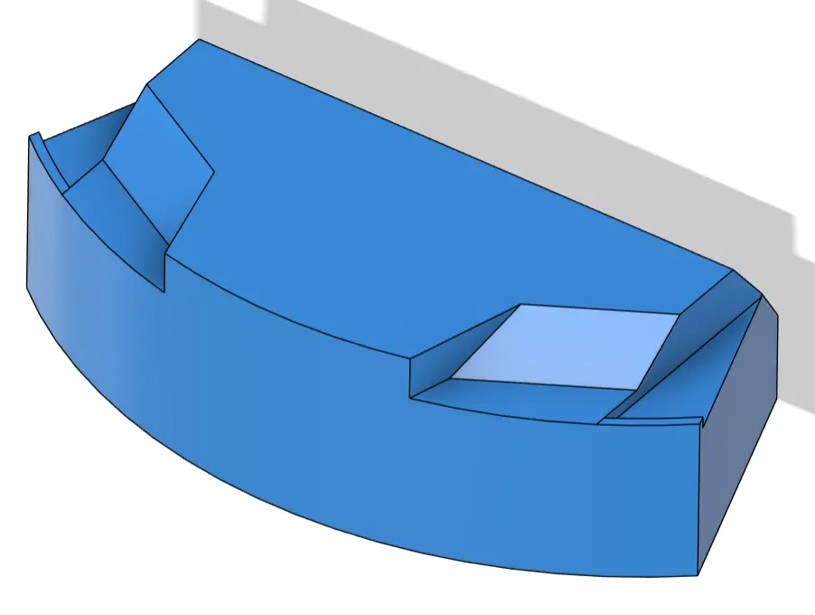

# Dust Bin (mechanical module)

This is a removable dust bin that collects dust, contains an air filter and receives air from the vacuum robot's master fan.

The dust bin lock is spring loaded with a retractable latch on top. The dust bin inlet mates with a gasket.

# Important References
- [Teardown dust bin module reference](https://github.com/remakeai/vacuum_cleaner_teardown/blob/main/step/U01.stp)
- [Teardown master assembly](https://github.com/remakeai/vacuum_cleaner_teardown/blob/main/step/MASTER-ASSM.stp)
- [Project discussions](https://github.com/makerspet/oomwoo/discussions?discussions_q=)
- [Discord server](https://discord.gg/3y2JKz5T25)

### Assembled vacuum, no top - back

# Request for Contribution - Instructions

- review the teardown master assembly
- start with the teardown reference STEP file
  - post in [Project Discussions](https://github.com/makerspet/oomwoo/discussions?discussions_q=) to let everyone know you're working on it
  - post your progress as well
- pick material thickness to ensure sturdiness without excess weight
- redesign it into a dust bin
  - note: the air inlet, the air filter and the spring lock are missing in the reference design - you'll need to fill these details in
- ignore all mop functionality for now
- make sure the dust bin can be removed and inserted back easily and reliably
  - if you need off-the-shelf sub-components (e.g. steel springs), find those, add to your design and add a link to your submission
  - make off-the-shelf sub-components sure they easy to source and inexpensive
- make your design 3D printable
  - assume PETG
  - make the part easy to 3D print - ideally no supports - and reproduced reliably
  - make the sliced part fit a 20cm by 25cm, 20 cm height. Split the part if necessary.
- preserve (1) the part outer shape and (2) the way the part mates with the rest of the design (*)
- test it well
  - 3D print it, make sure it works, mates with the rest of the design
- submit a PR (pull request) to `contributions/dust-bin/<your-github-username>/`
  - design: 3D STEP files, 3D CAD source files (Fusion 360, Solidworks, etc.) and 3MF/STL files
  - make sure to submit the master STEP assembly file
  - submit BoM of all sub-components
  - instructions, documentation - how to use, assemble, 3D print, troubleshoot, test results
  - photos, videos
  - announce your submission in [Project Discussions](https://github.com/makerspet/oomwoo/discussions?discussions_q=)
- iterate with review
- TBD, expect the RFC to evolve

(*) if you have a strong reason to change the part's outer shape, size, part mating, part material or something else of that sort,
please post your raionale in [discussions](https://github.com/makerspet/oomwoo/discussions?discussions_q=).

### Dust bin - back

### Dust bin - front

### Assembled vacuum - back

## Acceptance criteria

Objective, measurable. Examples:
- Fits the reference chassis without modification to other modules
- Performs its function
  - no air leaks
  - easy to empty
- Reasonable mass, size, cost budget
- Documented and reliably reproducible by someone else
- TBD, expect criteria to evolve

The maintainer selects among compliant candidates using these criteria. Multiple
attempts are welcome and useful even if not selected — modules are swappable, and
a non-selected design is still a valid learning exercise and a fallback.
